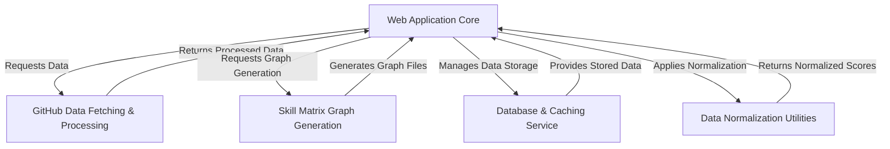

# Tutorial: skill-matrix-tool

This tool is a **web application** that helps developers visualize their *programming language skills*. You enter a GitHub username, and it fetches data from their public repositories to analyze language usage and create an interactive "skill matrix" – a *radar chart* that visually represents your proficiency. It also offers a **REST API** for programmatic access to skill data and speeds things up by *caching* previously fetched information.

## Visual Overview

